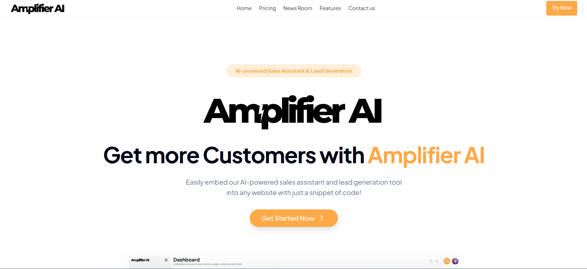
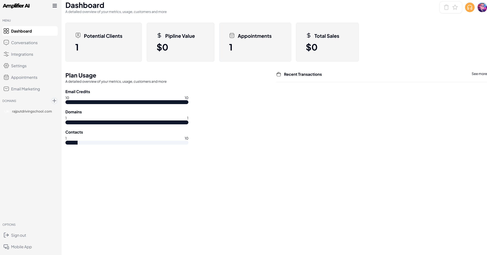
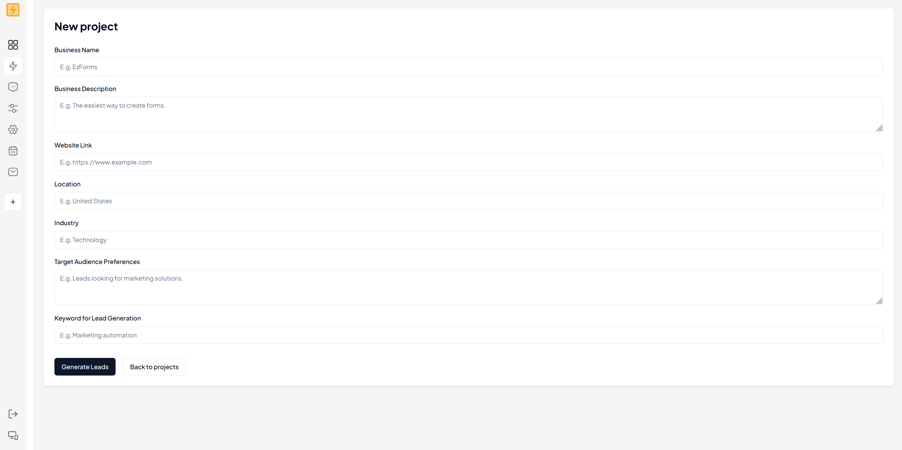
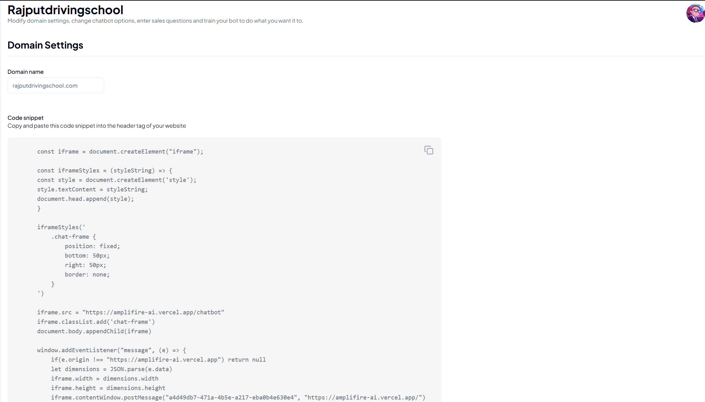
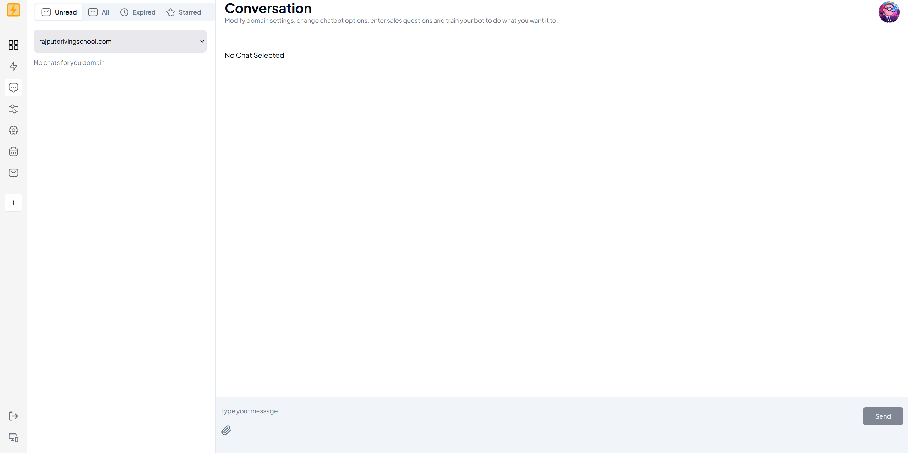
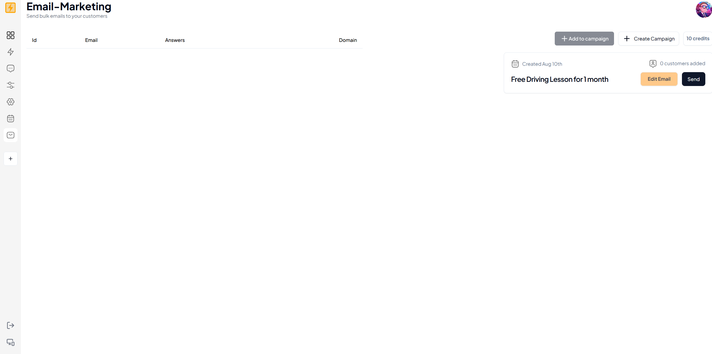

# Amplifier AI 🚀

**Revolutionizing Lead Generation & Customer Engagement with AI**

Amplifier AI is an innovative platform designed to help startups and small businesses overcome their biggest challenge: finding and engaging customers. As winners of the prestigious Headstarter Fellowship, we stood out among 15,000 participants and 3,000 teams with our cutting-edge, AI-driven solutions.

### AI Lead Generation

<video controls src="public/images/Presentation1.mp4" title="Lead Generation Example with Faizan"></video>

### AI Chatbot Integration & Book Appointment

<video controls src="public/images/Presentation2.mp4" title="Chatbot answers questions and book an appointment"></video>

## 🌟 Why We Built Amplifier AI

**61% of startups fail due to poor marketing strategies.** We built Amplifier AI to change that narrative. Our platform combines AI-powered lead generation and customer engagement tools, giving businesses the edge to succeed in competitive markets.

### **Tech Stack**

- **Frontend**: Next.js, TypeScript

- **Backend**: Python, Prisma, PostgreSQL

- **Cloud & APIs**: AWS S3, OpenAI API

- **Authentication & Payments**: ClerkAuth, Stripe

## 🏆 Achievements

- **Winners** of the Headstarter Fellowship, chosen among 15,000 participants.

- Built a platform that simplifies lead generation and customer engagement for startups and small businesses.

- Developed AI-powered tools that automate outreach, streamline customer support, and boost sales.

## ✨ Features

### **1. AI Lead Generator**

- **Automated Outreach**: Finds potential customers on LinkedIn, Twitter, Reddit, and more.

- **Sentiment Analysis**: Identifies users frustrated with competitors and introduces your solution.

- **Email Campaigns**: Custom email campaigns to users of your product/services.

- **Community Promotion**: Organically promote products in relevant Reddit and Twitter communities.

### **2. AI-Powered Customer Service Chatbot**

- **Simple Integration**: Add to your website with a single script tag.

- **Smart Responses**: Scans your site to provide accurate answers and book appointments.

- **24/7 Availability**: Always-on support improves response times and customer satisfaction.

- **Stripe Integration**: Handles payments and checkout directly within the chat.

## Project Screenshots 📸

### Main Dashboard Interface

_Home Page_

### Dashboard Overview

_Analytics and campaign management_

### AI Lead Generation

_Powerful AI lead Generator_

### AI Chatbot Integration

_Seamless AI ChatBot Integration with a simple HTML tag_

### Real-Time Chat Mode

_Real-time chat mode_

### Campaign Management

_Campaign creation and management interface_
